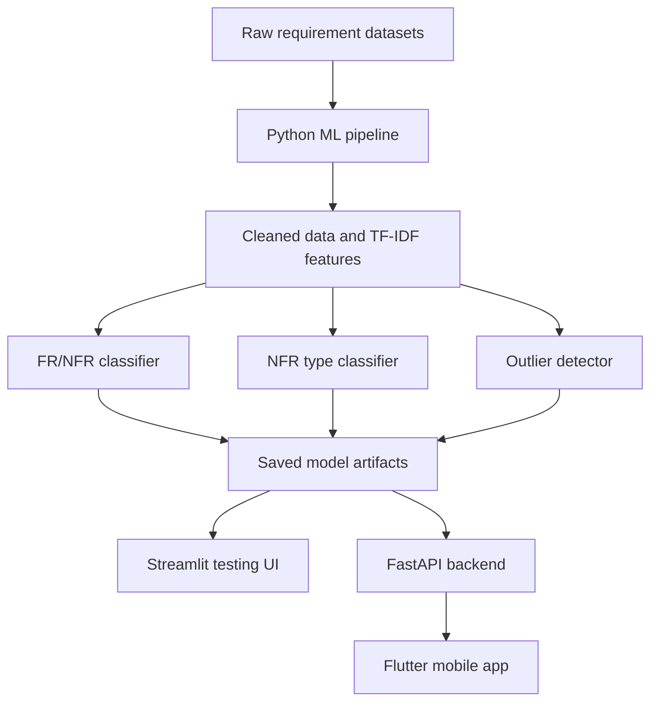
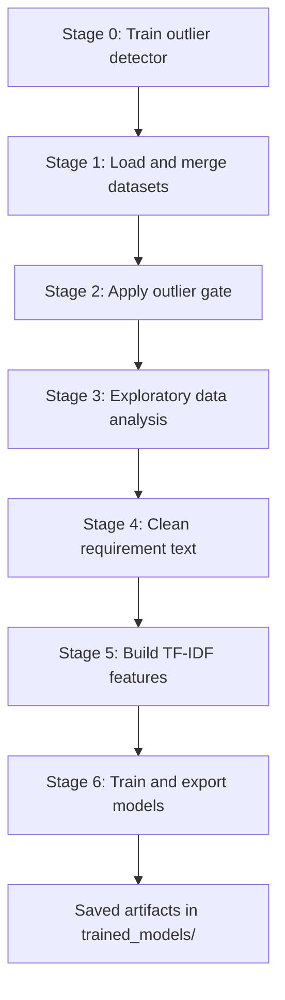
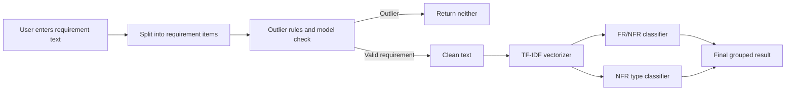

# Vertex IDS - Software Requirement Classification System

Vertex IDS is an academic machine learning project that classifies software requirement text into:

- Functional Requirements
- Non-Functional Requirements
- Neither / irrelevant text
- Specific Non-Functional Requirement categories such as security, usability, performance, scalability, portability, and maintainability

The project includes a full Python training pipeline, saved machine learning artifacts, a Streamlit testing interface, a FastAPI backend, and a Flutter mobile client.

## Academic Context

This repository was developed as a semester project by:

- Muhammad Shahzaib
- Syed Muhammad Hamza Sultan

Academic instructor:

- Dr. Arif ur Rehman

Academic guidance:

- Ma'am Laiba Gul

The goal of this project is to demonstrate a complete machine learning workflow for software requirement engineering: dataset preparation, preprocessing, feature engineering, model training, evaluation, API serving, and mobile application integration.

## Table of Contents

- [What the Project Does](#what-the-project-does)
- [Problem Statement](#problem-statement)
- [System Overview](#system-overview)
- [Main Features](#main-features)
- [Technology Stack](#technology-stack)
- [Dataset](#dataset)
- [Machine Learning Approach](#machine-learning-approach)
- [Pipeline Flow](#pipeline-flow)
- [Prediction Flow](#prediction-flow)
- [Repository Structure](#repository-structure)
- [How to Run](#how-to-run)
- [API Endpoints](#api-endpoints)
- [Flutter Mobile App](#flutter-mobile-app)
- [Saved Model Artifacts](#saved-model-artifacts)
- [Academic Notes](#academic-notes)
- [License](#license)

## What the Project Does

In simple words, Vertex IDS reads a software requirement sentence and predicts what type of requirement it is.

Example input:

```text
The system shall encrypt all user passwords before storing them.
```

Expected output:

```text
Non-Functional Requirement
NFR Type: Security
```

Another example:

```text
The user shall be able to reset their password using email verification.
```

Expected output:

```text
Functional Requirement
```

If the input is not a requirement, such as a greeting or random text, the outlier gate can classify it as:

```text
Neither / irrelevant
```

## Problem Statement

Software projects usually contain many requirement statements. Manually separating functional and non-functional requirements takes time and can be inconsistent. This project provides an automated academic prototype that helps identify:

- What the system should do
- How the system should behave
- Which quality category a non-functional requirement belongs to
- Whether a given text is not a useful software requirement

## System Overview



The repository has three practical layers:

- Training layer: numbered Python scripts in `PROJECT/`
- Serving layer: FastAPI backend in `backend/` and deployment-compatible backend code under `vertex_app/backend/`
- Client layer: Flutter app in `vertex_app/`

## Main Features

- Outlier detection for greetings, random text, and non-requirement input
- Binary classification for Functional vs Non-Functional requirements
- Multi-label classification for NFR categories
- TF-IDF feature extraction with unigrams and bigrams
- Saved model artifacts for repeatable inference
- Streamlit UI for quick testing
- FastAPI service for backend integration
- Flutter mobile app with chat-style classification, model information, diagnostics, and export support

## Technology Stack

| Area | Tools |
| --- | --- |
| Language | Python, Dart |
| ML / NLP | Scikit-learn, NLTK, Pandas, NumPy, SciPy |
| Feature Engineering | TF-IDF vectorization |
| Models | Logistic Regression, MultiOutputClassifier, IsolationForest support |
| Web Testing UI | Streamlit |
| Backend API | FastAPI, Uvicorn, Pydantic |
| Mobile App | Flutter, Riverpod, Go Router, Dio |
| Export / Sharing | CSV and PDF support in the Flutter client |

## Dataset

The project uses requirement datasets stored in `DATASETS/`.

Important input files:

- `DATASETS/PROMISE-relabeled-NICE.csv`
- `DATASETS/synthetic_NFR_augmentation.csv`

Generated or cleaned CSV files are also stored in the same folder so later pipeline stages can reuse them:

- `DATASETS/PROMISE-relabeled-NICE_cleaned_v1.csv`
- `DATASETS/synthetic_NFR_augmentation_cleaned_v1.csv`
- `DATASETS/combined_stage1.csv`
- `DATASETS/combined_stage2_filtered.csv`
- `DATASETS/combined_stage4_cleaned.csv`
- `DATASETS/outlier_review.csv`
- `DATASETS/outlier_review_from_extra.csv`

## Machine Learning Approach

The academic approach follows a simple and explainable NLP pipeline.

1. Data loading

   The PROMISE dataset and synthetic NFR dataset are loaded from CSV files.

2. Text cleaning

   Requirement text is lowercased, punctuation is removed, stop words are removed, numbers are normalized, and words are lemmatized.

3. Outlier filtering

   Basic rules and a trained outlier classifier help remove obvious non-requirement text.

4. Feature engineering

   Cleaned text is converted into TF-IDF vectors using unigrams and bigrams.

5. FR/NFR classification

   A Logistic Regression model predicts whether a requirement is functional or non-functional.

6. NFR type classification

   A multi-output classifier predicts one or more non-functional categories.

7. Export

   The trained models, vectorizer, labels, and metadata are saved under `trained_models/`.

## Pipeline Flow



Pipeline files:

| Stage | File | Purpose |
| --- | --- | --- |
| 0 | `PROJECT/0_Outlier_Training.py` | Trains the outlier detector |
| 1 | `PROJECT/1_Load_and_Merge.py` | Loads and merges source datasets |
| 2 | `PROJECT/2_Outlier_Gate.py` | Flags and filters non-requirement text |
| 3 | `PROJECT/3_EDA.py` | Prints basic dataset analysis |
| 4 | `PROJECT/4_Data_Cleaning.py` | Cleans and deduplicates text |
| 5 | `PROJECT/5_Feature_Engineering.py` | Builds TF-IDF features |
| 6 | `PROJECT/6_Model_Training_and_Export.py` | Trains and saves final models |

Run all stages with:

```bash
python PROJECT/RUN_PIPELINE_TRAINING.py
```

## Prediction Flow



The backend groups predictions into:

- `functional_requirements`
- `non_functional_requirements`
- `neither`
- `items`
- `counts`

## Repository Structure

The structure below focuses on source and repo-facing files. Local build outputs, IDE files, logs, virtual environments, generated reports, private iOS key files, and other ignored paths are intentionally omitted according to the `.gitignore` files.

```text
IDS_PROJECT/
|-- README.md
|-- LICENSE
|-- requirements.txt
|-- run.py
|-- DATASETS/
|   |-- PROMISE-relabeled-NICE.csv
|   |-- synthetic_NFR_augmentation.csv
|   |-- combined_stage1.csv
|   |-- combined_stage2_filtered.csv
|   |-- combined_stage4_cleaned.csv
|   |-- outlier_review.csv
|   `-- outlier_review_from_extra.csv
|-- PROJECT/
|   |-- 0_Outlier_Training.py
|   |-- 1_Load_and_Merge.py
|   |-- 2_Outlier_Gate.py
|   |-- 3_EDA.py
|   |-- 4_Data_Cleaning.py
|   |-- 5_Feature_Engineering.py
|   |-- 6_Model_Training_and_Export.py
|   |-- RUN_PIPELINE_TRAINING.py
|   |-- pipeline_common.py
|   |-- pipeline_visuals_and_figures.py
|   |-- requirements.txt
|   `-- streamlit_ui.py
|-- trained_models/
|   |-- FR_NFRTrained_models/
|   `-- outlierTrained_model/
|-- backend/
|   |-- README.md
|   |-- requirements.txt
|   `-- app/
|       |-- main.py
|       |-- model_loader.py
|       |-- predictor.py
|       `-- schemas.py
`-- vertex_app/
    |-- pubspec.yaml
    |-- assets/
    |-- lib/
    |   |-- app/
    |   |-- core/
    |   `-- features/
    |       |-- about/
    |       |-- chat/
    |       |-- diagnostics/
    |       |-- model/
    |       `-- splash/
    |-- android/
    |-- ios/
    |-- linux/
    |-- macos/
    |-- web/
    |-- windows/
    `-- backend/
```

## How to Run

### 1. Clone the repository

```bash
git clone <repository-url>
cd IDS_PROJECT
```

### 2. Create a Python environment

Windows PowerShell:

```powershell
python -m venv .venv
.\.venv\Scripts\activate
```

macOS / Linux:

```bash
python -m venv .venv
source .venv/bin/activate
```

### 3. Install Python dependencies

For the training pipeline and Streamlit UI:

```bash
pip install -r PROJECT/requirements.txt
```

For the FastAPI backend only:

```bash
pip install -r backend/requirements.txt
```

### 4. Train or refresh the models

```bash
python PROJECT/RUN_PIPELINE_TRAINING.py
```

This creates or updates the saved model artifacts in `trained_models/`.

### 5. Run the Streamlit testing UI

```bash
streamlit run PROJECT/streamlit_ui.py
```

Use this interface when you want to test one requirement quickly from the browser.

### 6. Run the FastAPI backend

From the repository root:

```bash
cd backend
uvicorn app.main:app --host 0.0.0.0 --port 8000 --reload
```

Open:

```text
http://localhost:8000/health
```

For the deployment-compatible entry point used by `run.py`:

```bash
python run.py
```

## API Endpoints

| Method | Endpoint | Purpose |
| --- | --- | --- |
| GET | `/health` | Checks whether the API is running |
| POST | `/predict` | Classifies requirement text |
| GET | `/model-info` | Returns model metadata and metrics |

Example request:

```json
{
  "text": "The system shall encrypt all user data at rest.\nThe system shall allow users to reset passwords.",
  "force_classify": false
}
```

Example response shape:

```json
{
  "functional_requirements": [],
  "non_functional_requirements": [],
  "neither": [],
  "items": [],
  "counts": {
    "functional": 0,
    "non_functional": 0,
    "neither": 0,
    "total": 0
  }
}
```

## Flutter Mobile App

The mobile client lives in `vertex_app/`.

Install Flutter dependencies:

```bash
cd vertex_app
flutter pub get
```

Run with the default production backend:

```bash
flutter run
```

Run with a local backend:

```bash
flutter run --dart-define=API_BASE_URL=http://localhost:8000
```

For Android emulator local backend testing, use:

```bash
flutter run --dart-define=API_BASE_URL=http://10.0.2.2:8000
```

Build examples:

```bash
flutter build apk --release
flutter build ios --release
```

The Flutter app includes:

- Chat-style prediction screen
- Model overview screen
- Diagnostics screen
- About screen
- CSV export support
- PDF sharing support on supported platforms

## Saved Model Artifacts

The main application reads these files after training:

```text
trained_models/FR_NFRTrained_models/model_fr_nfr.pkl
trained_models/FR_NFRTrained_models/model_nfr_types.pkl
trained_models/FR_NFRTrained_models/vectorizer_combined.pkl
trained_models/FR_NFRTrained_models/model_metadata.pkl
trained_models/FR_NFRTrained_models/nfr_types.npy
trained_models/FR_NFRTrained_models/combined_tfidf_matrix.npz
trained_models/outlierTrained_model/outlier_vectorizer.pkl
trained_models/outlierTrained_model/outlier_classifier.pkl
trained_models/outlierTrained_model/outlier_metrics.pkl
```

## Academic Notes

- This is an academic prototype, not a commercial production system.
- The ML approach favors readability and explainability over maximum model complexity.
- TF-IDF and Logistic Regression were selected because they are understandable, fast, and suitable for semester-level demonstration.
- Prediction quality depends on the dataset quality, label consistency, and coverage of requirement types.
- If the datasets or preprocessing logic change, rerun the full training pipeline so the saved artifacts stay consistent.

## License

This project is covered by the academic license in `LICENSE`.

