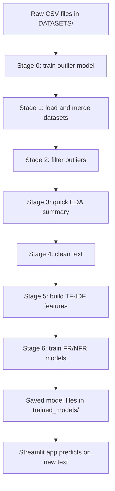
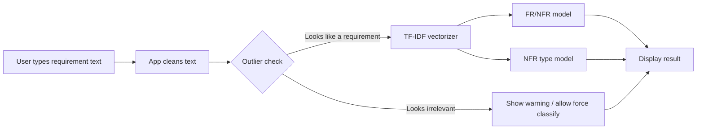

# Software Requirements Classification Pipeline

This repository turns raw software requirement text into a working classifier.
It trains models for three tasks:

1. spotting obvious outliers or non-requirement text
2. predicting Functional vs Non-Functional requirement labels
3. predicting the Non-Functional type when a requirement is NFR

The code is split into small numbered scripts so each stage is easier to read,
debug, and run on its own.

## What the final app does

The Streamlit app in [PROJECT/app.py](PROJECT/app.py) does not retrain the model.
It loads saved artifacts from the `trained_models` folder, converts your text
with the saved TF-IDF vectorizer, and then asks the trained classifiers for a
prediction.

In simple terms:

- training scripts create the model files
- the app reads those model files later
- your text is cleaned, turned into numbers, and scored by the saved models

## Data sources

The project uses the PROMISE requirement dataset plus a synthetic NFR dataset.
Main input files live in [DATASETS/](DATASETS/):

- [PROMISE-relabeled-NICE.csv](DATASETS/PROMISE-relabeled-NICE.csv)
- [synthetic_NFR_augmentation.csv](DATASETS/synthetic_NFR_augmentation.csv)

Cleaned and intermediate CSV files are also written back into the same folder
so later stages can reuse them.

## Pipeline flow



## Prediction flow in the app



## Files and what they do

### [PROJECT/0_Outlier_Training.py](PROJECT/0_Outlier_Training.py)
Trains the outlier detector used before the main model pipeline. It loads local
requirement text, optionally pulls extra public text examples, trains an outlier
classifier, and saves the outlier artifacts.

### [PROJECT/1_Load_and_Merge.py](PROJECT/1_Load_and_Merge.py)
Loads the PROMISE and synthetic datasets, cleans them if needed, and merges them
into one combined CSV for the later stages.

### [PROJECT/2_Outlier_Gate.py](PROJECT/2_Outlier_Gate.py)
Uses simple rules and the trained outlier model to remove obvious non-requirement
text before the main model is trained.

### [PROJECT/3_EDA.py](PROJECT/3_EDA.py)
Prints a small exploratory summary of the filtered dataset, including shape,
missing values, label balance, and text length checks.

### [PROJECT/4_Data_Cleaning.py](PROJECT/4_Data_Cleaning.py)
Normalizes the requirement text, removes duplicates, removes empty rows, and
writes the cleaned dataset used by feature engineering.

### [PROJECT/5_Feature_Engineering.py](PROJECT/5_Feature_Engineering.py)
Turns cleaned requirement text into TF-IDF numbers and saves both the vectorizer
and the sparse feature matrix.

### [PROJECT/6_Model_Training_and_Export.py](PROJECT/6_Model_Training_and_Export.py)
Trains the Functional vs Non-Functional classifier and the multi-label NFR type
classifier, then saves the model files and metadata.

### [PROJECT/RUN_PIPELINE_TRAINING.py](PROJECT/RUN_PIPELINE_TRAINING.py)
Runs stages 0 through 6 in order, each in a fresh Python process.

### [PROJECT/app.py](PROJECT/app.py)
Streamlit app for testing one requirement at a time. It loads the trained files,
checks for outliers, predicts FR/NFR, and shows detected NFR types.

### [PROJECT/pipeline_common.py](PROJECT/pipeline_common.py)
Shared helper file for paths, text cleaning, NLTK setup, and dataset loading.
This keeps the stage scripts simple and avoids repeating the same code.

### [PROJECT/requirements.txt](PROJECT/requirements.txt)
Lists the Python packages needed to run the pipeline and the app.

## Output folders

- [DATASETS/](DATASETS/) stores raw, cleaned, and intermediate CSV files
- [trained_models/FR_NFRTrained_models](trained_models/FR_NFRTrained_models) stores the main classifier artifacts
- [trained_models/outlierTrained_model](trained_models/outlierTrained_model) stores the outlier detector artifacts

## Training pipeline order

```text
Stage 0 -> Stage 1 -> Stage 2 -> Stage 3 -> Stage 4 -> Stage 5 -> Stage 6
```

The stages are intentionally small:

- Stage 0 trains the outlier model first
- Stage 1 combines the raw datasets
- Stage 2 removes obvious junk text
- Stage 3 prints a quick data summary
- Stage 4 cleans the text
- Stage 5 builds TF-IDF features
- Stage 6 trains and exports the final models

## How to run

### Install requirements

```bash
pip install -r PROJECT/requirements.txt
```

### Run the full training pipeline

```bash
python PROJECT/RUN_PIPELINE_TRAINING.py
```

### Run the app

```bash
streamlit run PROJECT/app.py
```

The app should open in your browser after Streamlit starts.

## What gets saved

After a successful pipeline run, the important saved files are:

- `trained_models/FR_NFRTrained_models/model_fr_nfr.pkl`
- `trained_models/FR_NFRTrained_models/model_nfr_types.pkl`
- `trained_models/FR_NFRTrained_models/vectorizer_combined.pkl`
- `trained_models/FR_NFRTrained_models/model_metadata.pkl`
- `trained_models/FR_NFRTrained_models/nfr_types.npy`
- `trained_models/outlierTrained_model/outlier_vectorizer.pkl`
- `trained_models/outlierTrained_model/outlier_classifier.pkl`

These files are what the app reads when you type text into the UI.

## Notes

- The app uses the saved models only; it does not rerun the training scripts
  every time you make a prediction.
- The helper file [PROJECT/pipeline_common.py](PROJECT/pipeline_common.py)
  keeps paths and cleaning logic consistent across the whole project.
- If you change a stage, rerun the pipeline so the saved artifacts match the
  new code.
